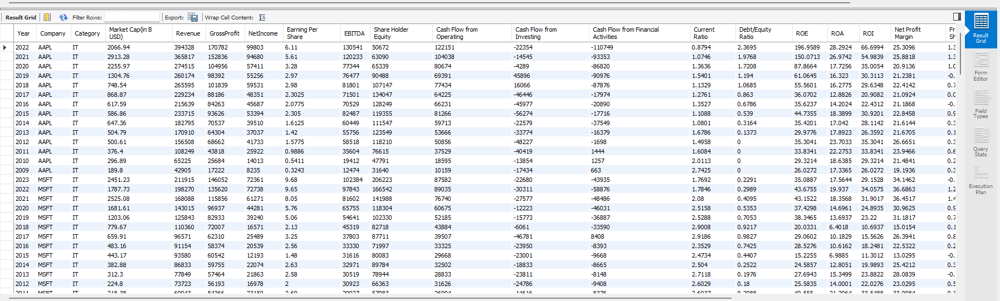

# Generative AI - Dice Batch 2 - Final Project By Tayyab Hussain
## Chatbot with Database & Knowledge Base Agents
### Credits: Thanks Sir Zaid, Zain, Ali Raza Anjum & Dice Team 
---
* Objective
The goal of this project is to build an ***intelligent chatbot application*** that can automatically decide how to answer user queries. The chatbot will use ***Agentic AI flows with LangGraph*** to determine whether a query should be answered by querying a ***database*** or by retrieving information from a ***knowledge base (vector store)***.
---
#### Installation Instruction 
* Create environment Setup
    * Create a virtual environment using command:
        ```python
        uv venv my-environment-name --python 3.10.8
        .venv\Scripts\activate.bat
        ```
    * Install requirements.txt using:
         ```python
        uv pip install -r requirements.txt        
        ```
    * How to run application command:
         ```python
        streamlit run main.py        
        ```
---
#### Project Demo Video
[![Watch the video]](https://drive.google.com/file/d/162bJYUPS64iBwZVJ9WIf7ulmTQTt0ktx/view?usp=sharing)
---
#### Project Structure
* As practice in class, project business logic is in ***bl*** 
* ***assets, styles*** folder for storing css and images and other details
* ***chromadb*** folder that contains the embeddings 
* ***.env*** and ***requirements.txt*** file for saving project details.
* ***main.py*** is entry point for streamlit application.


---
#### Technical Requirements
##### ***Knowledge Base:*** Chromadb is used as vector store.
##### LLMs: Groq LLM ***_llama-3.3-70b-versatile_***
##### ***LangGraph*** for agentic orchestration (router + specialized agents).

##### ***Database:*** MySQL database is used. The data is imported from excel file. It is also attach

##### ***Frontend:*** Streamlit frontend framework is used.

##### ***Create Embedding*** Streamlit frontend framework is used.

##### ***About Me*** for developer information


